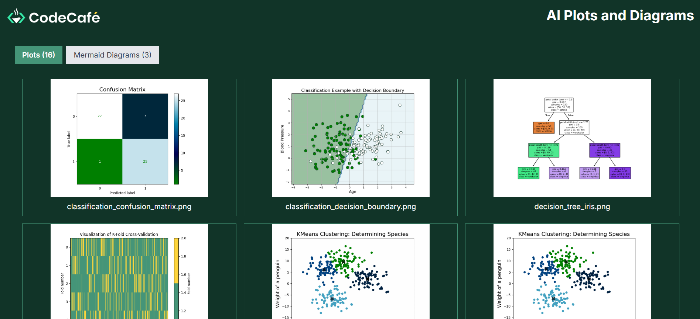

# V0-website

The website in this repository was generated using the tool v0.dev for educational purposes. 
It's not perfect in terms of code quality, but gives us an idea of what we can accomplish 
with just a few prompts.

The website itself was made to display plots from https://github.com/het-code-cafe/AI-tools-learning. 
Additionally, a functionality to display diagram renders was added. This all took about 20 prompts, 
many of which were attempts at fixing the same bug. Eventually, a tiny bit of copy-paste assistance was 
issued by a human (one component was copied from another version in which it works). 
